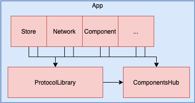

# ComponentsHub

## 背景
在各种业务与组件不断增长的时候，他们之间的各种依赖关系显得尤其复杂。

且使用Cocoapods或Carthage等管理使得各个模块趋于独立化。如果一个静态库被多个模块依赖，会导致这个静态库被多次包含在可执行文件中，增加了App包的体积。而大量使用动态库会导致App在冷启动时，加载动态库时间越来越长。

同时为了组件满足DRY原则，那么就很有必要做 **组件通信**。

同时也为了App支持URL Router。

## 一、美团的技术解决方案（OC版）
[相关链接](https://juejin.im/post/5be4f3eaf265da614b117e81)

[Github代码Demo](https://github.com/dsxNiubility/WMScheduler)

### 业界四大方向
* DI 依赖注入，通用做法 protocol-class
* SPI机制，Service Provider Interface		(效率优)
* 通知中心
* objc_msgSend	(效率优，可读性差)

### 美团的技术方案（基于SPI机制）
* Category + NSInvocation
* CategoryCoverOrigin方式

### Category治理
linkmap tools 主要防止category的重复实现。

## 二、protocol-class方式
核心基于protocol-class方式。如TinyPart库等。类似蘑菇街、RN等架构设计。

## 三、本库实现的纯Swift方案

* 基础库ComponentsHub，使用单例支持协议的 注册闭包、获取、取消注册等操作。因为供多个库使用，故采用Dynamic Library，且Embed至其上层静态库以及App。
	* 接收创建对应协议的闭包。
	* 支持创建对应协议的单例。
	* 【TODO】添加Router支持。

* 定义ProtocolLibrary库，为为各种业务需求协议库。例如网络、存储、界面组件等。因为供多个库使用，故采用Dynamic Library，且Embed至其上层静态库以及App。
	* 该库可以根据具体使用情况调整，不一定全部放一个库中。比如把基本不修改的协议单独放，经常修改的变为多个单独库等等。

* 再就是各种业务或者基础库，如StoreLib、NetworLib、ComponentXXX等等。这些库可以设置为Static Library。且在App的link framework & library设置中去掉 Embed 标记。这样就会编译至App包中，减少App启动时加载动态库时间。

* 在每一个实现ProtocolLibrary中的协议库，也就是业务或基础库，应该都有一个该库的initialComponents方法初始化配置对应协议的实现对象。然后这些初始化方法由App启动时刻调用。

## 四、才疏学浅，求大神多多指教。
期待 ：）

## 五、如有使用问题怎么办？
欢迎砸我邮箱 [jate_xu@icloud.com](mailto:jate_xu@icloud.com)
